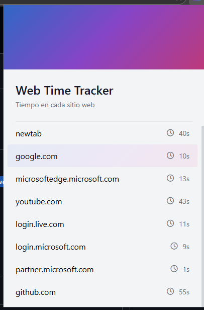

# 🕒 Web Time Tracker

A Chromium-based browser extension that automatically tracks how much time you spend on each website.

Main features:

- Automatic tracking of time spent on each visited domain.
- Accumulated history of website usage.
- Clear and simple visualization of history from the extension popup.
- Local storage of data, without sending information to external servers.

Screenshot:

